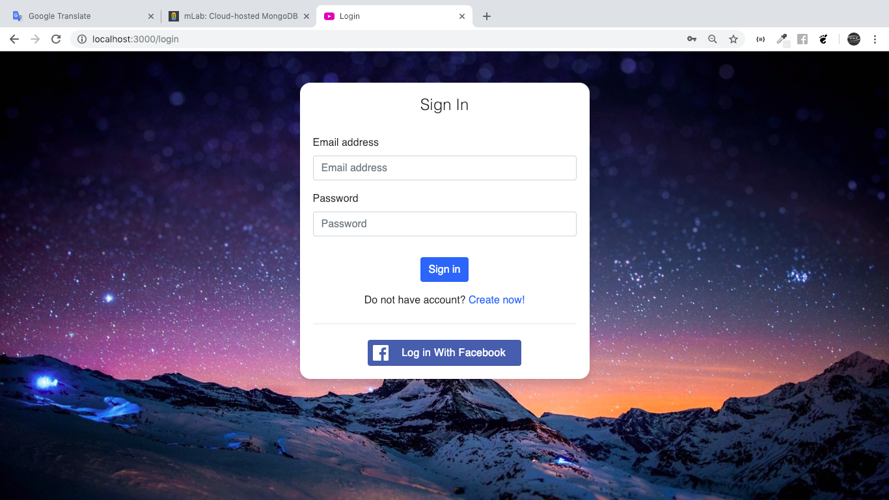
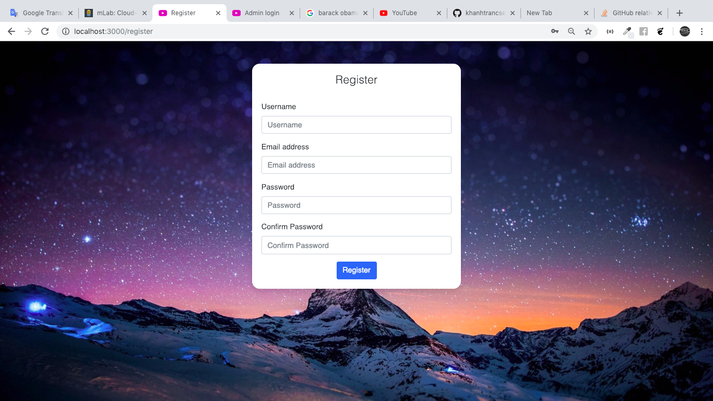
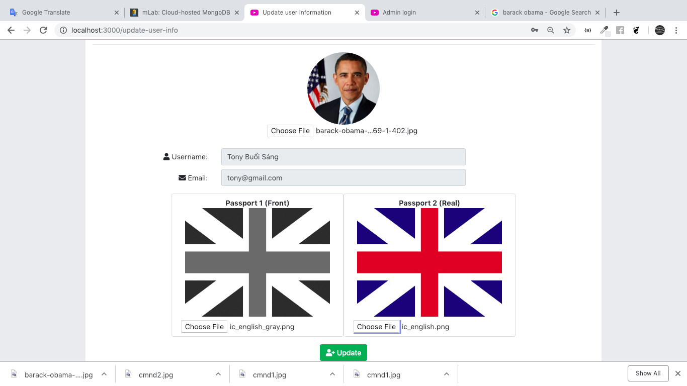
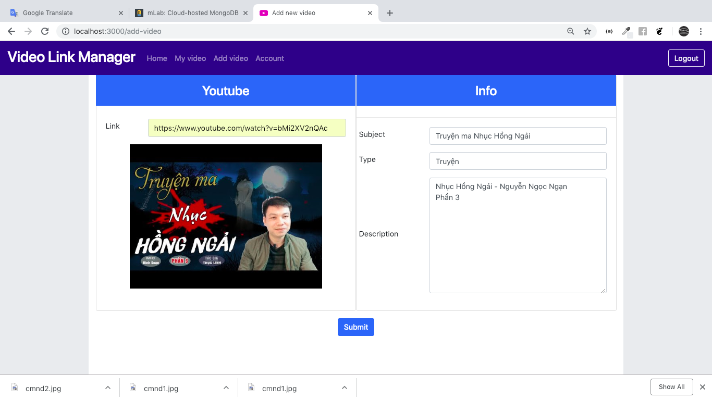
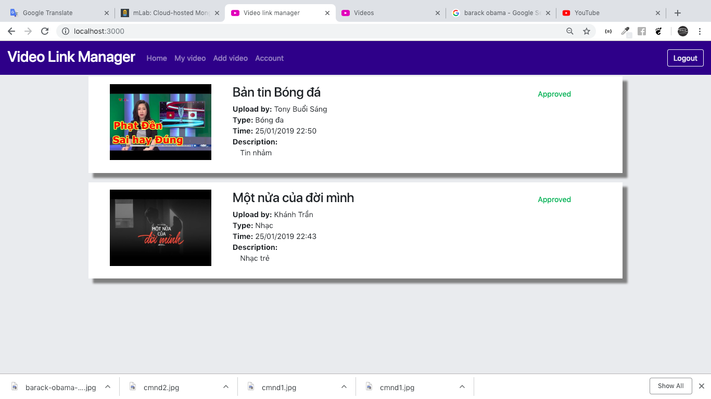
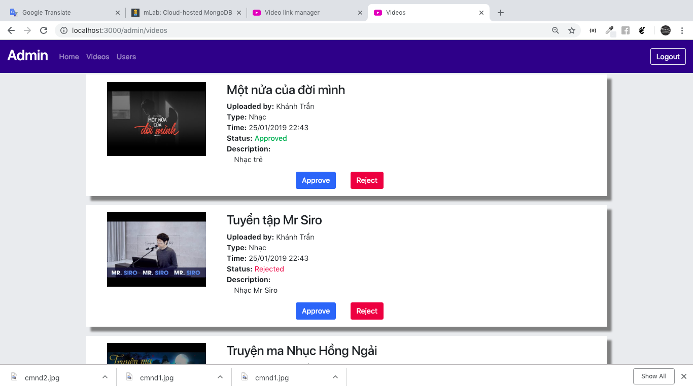
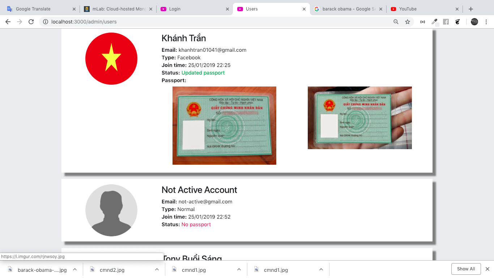

# Video Link Manager

A web that allows user upload and manage Youtube Video.

## Run instruction

1. Go to root directory.
1. Install dependent packages: ```npm install```
2. Run server: ```npm start```

## Features

### User

1. Register account
2. Login with registered account
3. Login with facebook
4. Update avatar and passport image
5. View all videos that was approved by admin
6. View videos of login user
7. Add new video (Get thumbnail image of video automatically)

### Admin

1. Login
2. View all videos (sorted by uploaded time)
3. View all users (sorted by name)
4. Approve or reject a video

## Screenshots

This is some screenshot images. To view all image, [click here](screenshots)

Login

Register

Update infor

Add video

Home

Admin view videos

Admin view users
