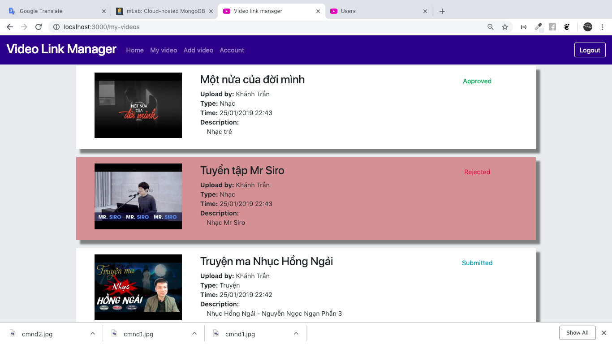

# Video Link Manager

A web that allows user upload and manage Youtube Video.

## Requirements

1. Nodejs
2. This project uses remote database ( https://mlab.com ), so you can run it without any database config. If you want to run it with your database, you have to change ```DATABASE_URI``` field in ```config.js``` file in root directory to your database address. Note that this project uses MongoDB.

3. This project uses remote image host to save uploaded images. If you want to save images at localhost, change ```SAVE_IMAGE_IN_REMOTE_HOST``` field in ```config.js``` file in root directory to ```false```.

**Note:** This project will response slowly for some requests because this project uses remote database.

## Run instruction

1. Go to root directory.
2. Install dependent packages: ```npm install```
3. Run server: ```npm start```. Server runs at address ```localhost:3000```.
4. Login to admin:
    - Go to ```localhost:3000/admin```
    - Login with username: **admin** and password: **admin**.

**Note:** This project will response slowly for some requests because this project uses the remote database.

## Features

### User

1. Register account
2. Login with registered account
3. Login with facebook
4. Update avatar and passport image
5. View all videos that was approved by admin
6. View videos of login user
7. Add new video (Get thumbnail image of video automatically)

**Note:** Facebook Login requires https protocol so you can't test login with Facebook feature. If you want to test this fearture, please do:
 * Change ```facebookId``` in ```public/javascripts/login.js``` file to your Facebook id.

 or

 * Send me your facebook link and I will make you as **tester**. My email: ```khanhtran.cse@gmail.com```

### Admin

1. Login
2. View all videos (sorted by uploaded time)
3. View all users (sorted by name)
4. Approve or reject a video

## Screenshots

This is some screenshot images. To view all images, [click here](screenshots)

Login

Register

Update infor

Add video

My video

Home

Admin view videos

Admin view users
